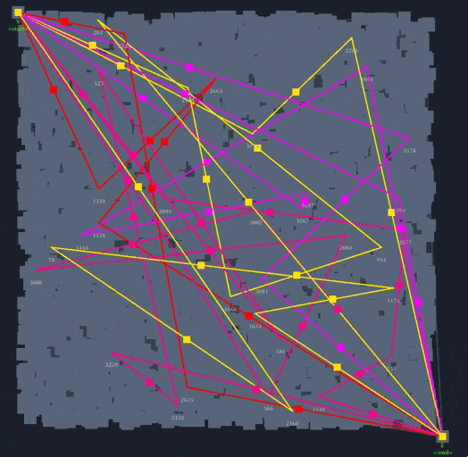

# 42-lem-in
The goal of this project is to find the quickest way to get n ants across the farm.


In Lem_in, we are given the number of ants, rooms and links to the rooms. There are the start and end rooms, and our goal is to get all the ants from beginning to end in the least amount of time.
```
10
1 0 2
##start
0 2 0
##end
4 2 6
2 4 2
3 4 4
0-1
0-2
2-3
3-4
4-1
0-4
0-2
```

The problem in Lem_in is to find all the different "sets of paths" and find the set suited for the given ant amount. As in our other projects, in Lem_in, it's also a problem where there is no copy and pastes answers, and we had to think about the issue and make a custom solution based on the Edmonds–Karp algorithm. 

Only one ant can be in one room at a time, so finding the shortest path is not enough. We need to find the max flow of the graph and different "sets of paths" because there can be multiple solutions. After all, some paths can block others from forming.
